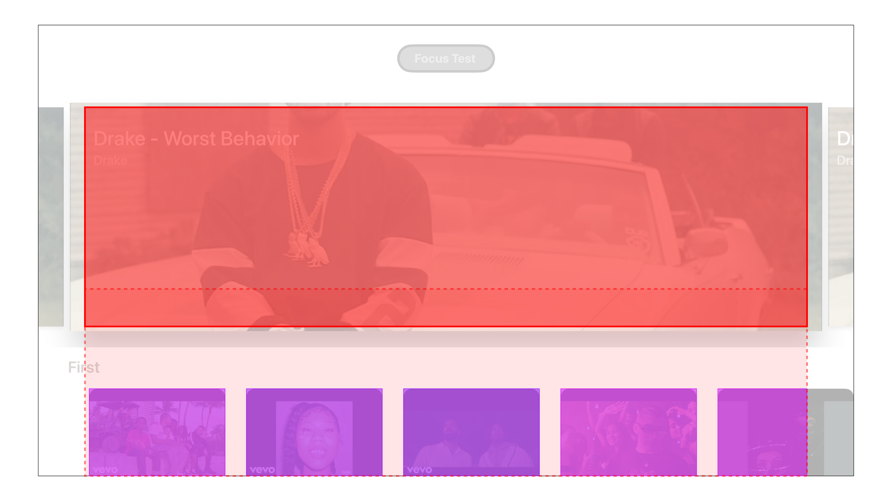

# UIFocusHelper

Various utilities to help debug focus engine issues. Originally started as a way to visualize focus guides, but eventually evolved deeper into creating focus engine snapshots, similar to those created when setting breakpoints in Xcode in didUpdateFocus: et al.

[](https://travis-ci.org/Kevin Bradley/UIFocusHelper)
[](https://cocoapods.org/pods/UIFocusHelper)
[](https://cocoapods.org/pods/UIFocusHelper)
[](https://cocoapods.org/pods/UIFocusHelper)

## Example
  <br/>
  <br/>
  <br/>
To run the example project, clone the repo, and run `pod install` from the Example directory first.

## Requirements

## Installation

UIFocusHelper is available through [CocoaPods](https://cocoapods.org). To install
it, simply add the following line to your Podfile:

```ruby
pod 'UIFocusHelper'
```

## License

UIFocusHelper is available under the MIT license. See the LICENSE file for more info.
